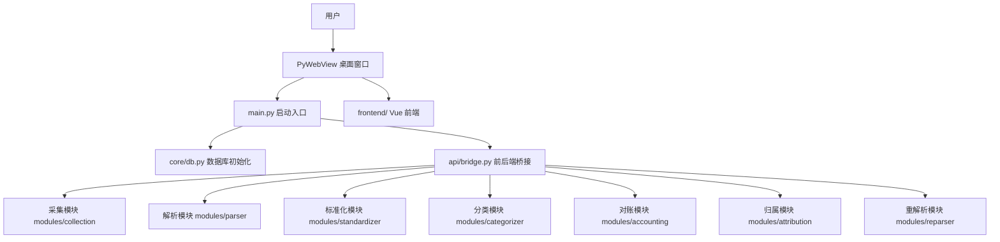
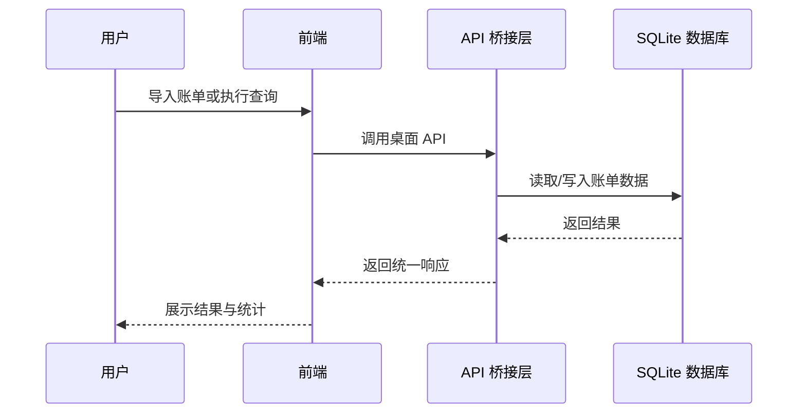

# 本地统一账单工具 - 项目说明

## 项目定位与优势

本项目更强调“多渠道账单统一治理”，而不是只做单纯的记账展示。它的价值主要体现在下面几方面：

- 本地优先，数据不出机器：所有账单、配置和数据库都保存在本机，适合对隐私和可控性要求更高的场景
- 面向真实账单复杂度：不是只处理一种格式，而是围绕微信、支付宝、建设银行等多渠道账单做统一接入
- 处理链路更完整：从采集、解析、标准化、分类、归属、对账到统计分析，形成一条可复用的自动化流水线
- 支持“导入后治理”：不仅能导入账单，还能继续做分类修正、枚举映射、合并、转账配对和快照回滚
- 适合长期维护：数据库结构采用“重建优先”的策略，配套 `scripts/init_db.sql`，更利于保持环境一致性
- 适合桌面本地使用：PyWebView 直接封装前端界面，启动体验更接近独立桌面工具，而不是分散在浏览器和服务端之间

如果用一句话概括，这个项目不是“记一笔账”的工具，而是“把散落在各平台的账单整理成统一资产视图”的工具。

## 功能概览

- 账单采集：支持文件导入、邮件收集等方式
- 账单解析：解析微信、支付宝、建设银行等渠道账单
- 标准化处理：统一字段、金额、时间、交易类型
- 分类管理：基于关键词和规则自动分类
- 账户与角色归属：支持账户识别、角色归属、家庭归档
- 对账与合并：支持跨平台合并、转账配对、信用卡流水识别
- 报表分析：提供看板、趋势、统计和明细查询
- 数据快照：支持变更快照与回滚
- 配置管理：支持分类规则、枚举映射、邮箱白名单等本地配置

## 账户与角色设计

账户、角色、家庭是本项目里非常关键的一层抽象，它的意义不只是“存几个名字”，而是把账单从“流水记录”进一步提升成“可管理的资产关系”。

- 账户负责承接真实账本入口：同一平台下可以区分不同账户，也可以保留别名、标签和合并关系
- 角色负责表示使用主体：当一个人名下有多个渠道账户时，可以通过角色把这些账户统一到同一使用者视角
- 家庭负责组织范围：角色可以继续挂到家庭上，便于看清家庭维度的支出、收入和归属关系
- 账单归属更稳定：账单表里同时保存 `account_id` 和 `role_id`，既能追溯原始账户，也能表达最终归属
- 适合多人共管：家庭成员共用账本时，不必把不同人的流水混在一起，后续统计和筛选会更清晰
- 适合长期演进：如果后续新增账户、合并账户或调整归属，只需要调整关系，不必重做整套账单数据

简单来说，这套设计让项目同时具备“个人账本视角”和“家庭账本视角”，也让跨平台、多账户、多人共管这几类真实场景更容易落地。

## 技术栈

- 后端：Python
- 桌面容器：PyWebView
- 前端：Vue 3、Vite、Pinia、Vue Router、Element Plus、ECharts
- 数据库：SQLite
- 常用解析库：openpyxl、xlrd、pandas、chardet、pyzipper、pycryptodome

## 系统结构




## 目录说明

- `main.py`：程序启动入口，负责初始化数据库、加载配置、启动本地前端窗口
- `api/`：PyWebView 暴露给前端的 API 桥接层
- `core/`：数据库、配置、加密、快照、事务等基础能力
- `modules/`：业务模块集合
- `frontend/`：前端工程
- `config/`：本地配置文件
- `scripts/`：数据库初始化、检查、修复、测试脚本
- `账单模板/`：账单样例与模板文件

## 启动方式

### 1. 准备环境

- Python 3.11+ 或项目实际可用版本
- Node.js 与前端构建环境
- SQLite 本地文件读写权限

### 2. 安装后端依赖

```bash
pip install -r requirements.txt
```

### 3. 安装前端依赖

```bash
cd frontend
npm install
```

### 4. 构建前端

```bash
cd frontend
npm run build
```

### 5. 启动程序

```bash
python main.py
```

启动后，程序会优先加载 `frontend/dist/index.html`。如果前端未构建，会提示先执行前端构建。

## 数据库说明

### 初始化方式

数据库文件默认位于 `data/wallet.db`。启动时如果数据库不存在，程序会自动初始化。

### 结构变更规则

- 数据库表结构变更时，不做数据迁移
- 直接重建数据库
- 需要维护一份统一的初始化脚本：`scripts/init_db.sql`

### 版本说明

数据库版本由 `core/db.py` 中的 `SCHEMA_VERSION` 管理。若版本不一致，建议按重建流程重新初始化数据库。

## 配置说明

本项目的运行配置主要放在 `config/` 目录下，当前包括：

- `category_keywords.json`：分类关键词规则
- `channel_enum_mappings.json`：各渠道枚举映射
- `email_whitelist.json`：邮件收集白名单

### 配置文件用途

- 分类关键词：用于自动识别账单类别
- 枚举映射：用于把渠道原始值统一成系统标准值
- 邮件白名单：用于过滤可收集的账单邮件

## 账单模板说明

`账单模板/` 目录保存了当前项目支持的账单样例与导入模板文件，包括：

- 微信支付账单流水文件
- 支付宝交易明细
- 建设银行相关账单模板

这些样例主要用于：

- 对照导入格式
- 验证解析规则
- 测试字段映射

也就是说，这个项目不是依赖用户手工整理表格，而是围绕真实账单导出文件做适配。对于经常跨平台消费、多个账户并存、账单格式不统一的用户，这种设计会更省日常维护成本。

## 业务流程



## 使用建议

- 导入前先确认账单模板是否与当前渠道格式一致
- 修改分类规则后，建议重新执行分类或复核结果
- 调整数据库结构时，优先同步更新 `scripts/init_db.sql`
- 若需要恢复干净环境，建议直接重建数据库而不是手工修补表结构
- 如果账单来源越来越多，优先补充 `config/` 下的映射规则和关键词，而不是直接在界面里人工修正每条记录
- 如果你希望保留更强的一致性，建议把“导入原始数据”和“后处理修正”分开看待，前者负责接入，后者负责治理
- 如果是多人或多账户场景，优先先确认账户、角色和家庭的归属关系，再做批量导入和分类，这样后续统计口径会更稳定

## 常见注意事项

- 本项目为本地桌面工具，不依赖云端部署
- 数据默认保存在本机 SQLite 文件中
- 前端如果没有构建完成，`main.py` 仍可启动，但会提示前端未构建
- `old/` 目录不参与当前项目说明与开发流程
- 由于项目定位是“统一治理”，它更适合长期积累账单数据，而不是只做一次性导入后就不再维护的轻量工具
- 账户或角色关系调整后，建议同步复核相关账单的归属筛选结果，避免统计口径发生偏差

## 相关脚本

- `scripts/init_db.sql`：数据库初始化脚本
- `scripts/rebuild_database.py`：重建数据库脚本
- `scripts/check_db_structure.py`：检查数据库结构
- `scripts/verify_migration.py`：迁移/结构验证脚本

## 说明

本说明文档基于当前仓库结构、启动入口、数据库脚本和账单模板整理，适合作为项目入口文档使用。
